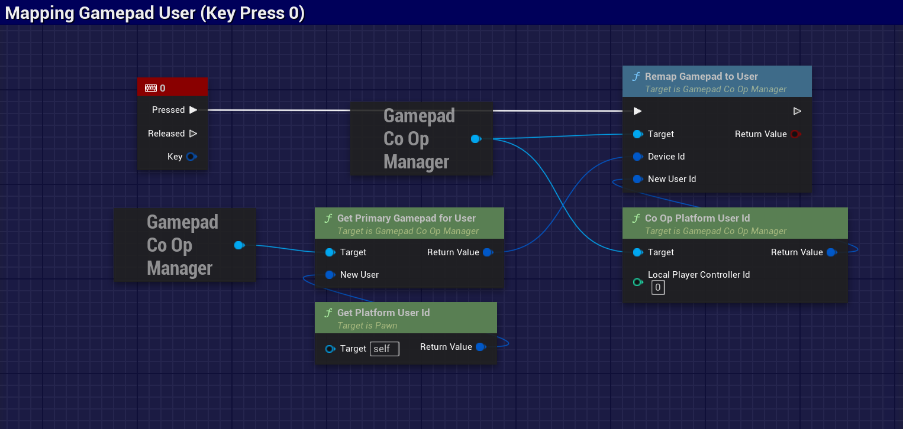
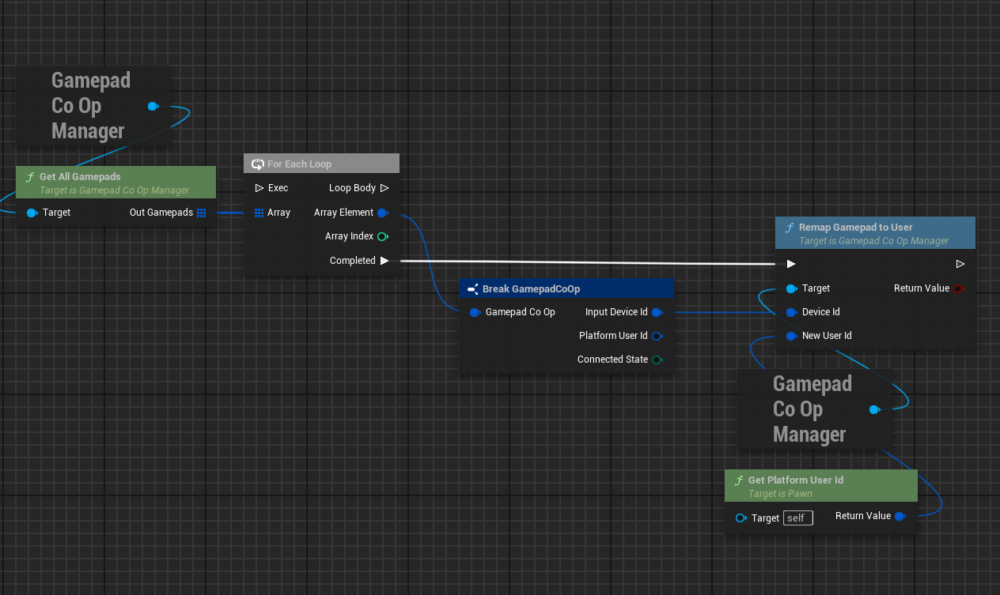
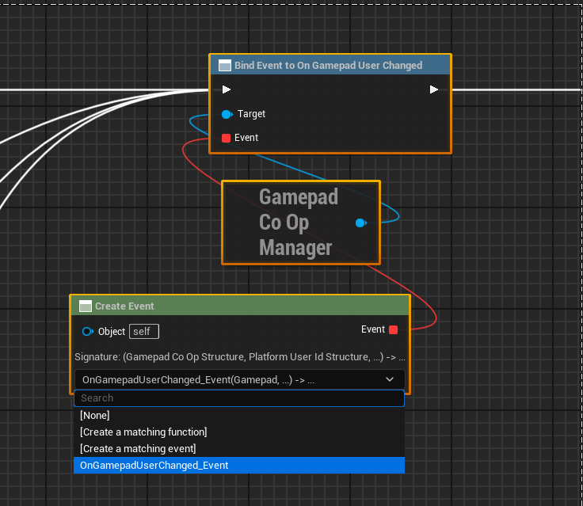
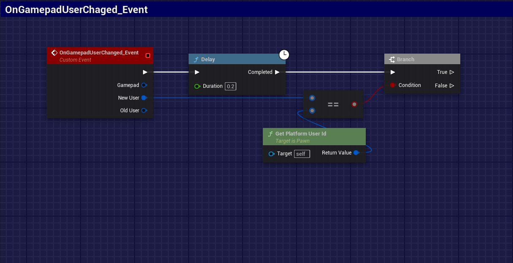

# 🎮 GamepadCoOp

[](https://semver.org)
[](LICENSE.md)
[](https://www.microsoft.com/windows)
[](https://www.unrealengine.com)

**GamepadCoOp** é um plugin para a Unreal Engine que oferece um gerenciamento robusto de gamepads para simplificar a criação de experiências multiplayer locais. Ele fornece uma camada de abstração sobre o sistema de entrada da engine para monitorar e gerenciar a associação entre dispositivos de hardware e usuários do jogo.

---

## ✨ Recursos Principais

*   **Gerenciamento Centralizado**: Acesso a todos os gamepads conectados através de um `GameInstanceSubsystem` (`UGamepadCoOpManager`), garantindo um ponto único de gerenciamento durante todo o ciclo de vida do jogo.
*   **Remapeamento Dinâmico de Usuário**: A funcionalidade principal do plugin é a capacidade de remapear dinamicamente um `FInputDeviceId` (dispositivo físico) para um `FPlatformUserId` (usuário do jogo) diferente em tempo de execução. Isso permite implementar com facilidade trocas de jogadores ou perfis.
*   **Monitoramento de Conexão**: O plugin detecta automaticamente a conexão e desconexão de gamepads, fornecendo delegates para que sua lógica de jogo possa reagir a esses eventos.
*   **Delegates para Eventos**: Responda a eventos importantes do ciclo de vida do gamepad:
    *   `OnGamepadConnected`
    *   `OnGamepadDisconnected`
    *   `OnGamepadUserChanged`
*   **API para C++ e Blueprints**: Projetado para ser totalmente acessível tanto em C++ quanto em Blueprints, permitindo uma integração flexível com qualquer tipo de projeto.

---

## 🚀 Instalação

1.  Baixe a versão mais recente na [página de Releases](https://github.com/YourRepo/GamepadCoOp/releases).
2.  Crie uma pasta `Plugins` na raiz do seu projeto Unreal, caso ela não exista.
3.  Extraia o conteúdo para dentro da pasta `Plugins`.
4.  Abra o seu projeto. O editor da Unreal irá solicitar a compilação do plugin.
5.  No editor, vá em `Edit > Plugins`, procure por `GamepadCoOp` e confirme que ele está ativado.

---


## 🎬 Demonstração


## 💡 Como Usar

O plugin funciona como um subsistema da `GameInstance`, o que torna o seu acesso direto e consistente.

### Acesso ao Manager

Para começar a usar o plugin, obtenha a instância do `UGamepadCoOpManager`.

**Blueprint:**

Use o nó `Get Game Instance`, seguido por `Get Subsystem`, e selecione `GamepadCoOpManager`.



List all devices


Event OnGamepadUserChanged


Event OnGamepadUserChanged



### Usage Example (C++)

The code below demonstrates how to implement a function that swaps gamepads between Player 0 and Player 1.

First, add the module as a dependency in your `.Build.cs` file:

```c++
    PublicDependencyModuleNames.AddRange(new string[] { "GamepadCoOp" });
```
```c++
    #include "Commons/GamepadCoOpManager.h"
    
    UGamepadCoOpManager* CoopManager = UGamepadCoOpManager::Get(this); // 'this' pode ser qualquer UObject no mundo do jogo.
```

Agora, você pode usar o manager para remapear os controles:
```c++
    // Obtenha os User IDs para os jogadores 0 e 1
    const FPlatformUserId Player0_UserId = CoopManager->CoOpPlatformUserId(0);
    const FPlatformUserId Player1_UserId = CoopManager->CoOpPlatformUserId(1);

    // Encontre qual dispositivo de entrada cada jogador está usando
    const FInputDeviceId Player0_DeviceId = CoopManager->GetPrimaryGamepadForUser(Player0_UserId);
    const FInputDeviceId Player1_DeviceId = CoopManager->GetPrimaryGamepadForUser(Player1_UserId);

    // Se ambos os dispositivos forem válidos, realize a troca
    if (Player0_DeviceId.IsValid() && Player1_DeviceId.IsValid())
    {
        UE_LOG(LogTemp, Log, TEXT("Trocando gamepads entre o usuário %d e %d"), Player0_UserId.GetInternalId(), Player1_UserId.GetInternalId());
    
        // Remapeia o dispositivo do Jogador 0 para o Jogador 1
        CoopManager->RemapGamepadToUser(Player0_DeviceId, Player1_UserId);
    
        // Remapeia o dispositivo do Jogador 1 para o Jogador 0
        CoopManager->RemapGamepadToUser(Player1_DeviceId, Player0_UserId);
    }

```

---

## 🤝 Contribuições

Contribuições são bem-vindas. Se você encontrar um bug ou tiver uma sugestão, por favor, abra uma [Issue](https://github.com/YourRepo/GamepadCoOp/issues). Para contribuir com código, faça um fork do repositório e envie um Pull Request.

---

## 📄 Licença

Este projeto é distribuído sob a licença MIT. Veja o arquivo `LICENSE.md` para mais detalhes.

