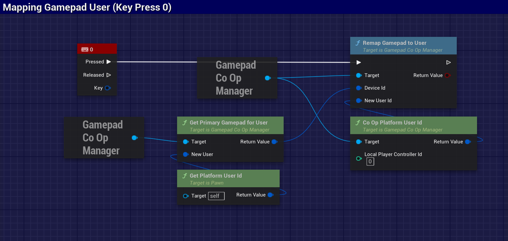
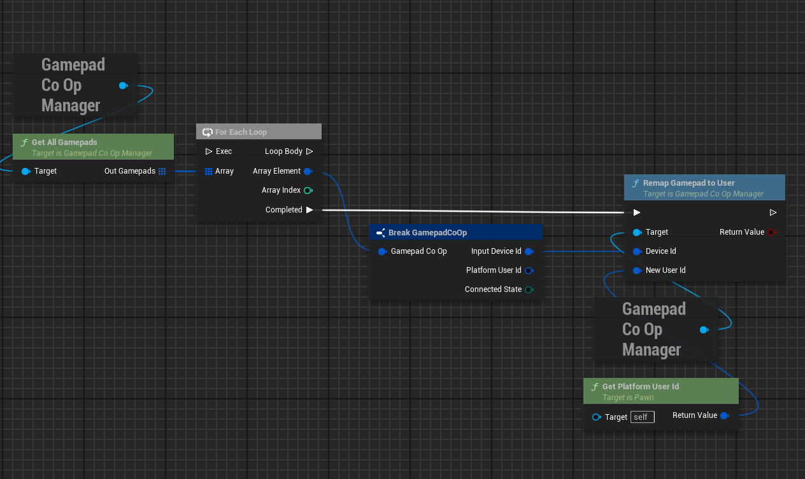
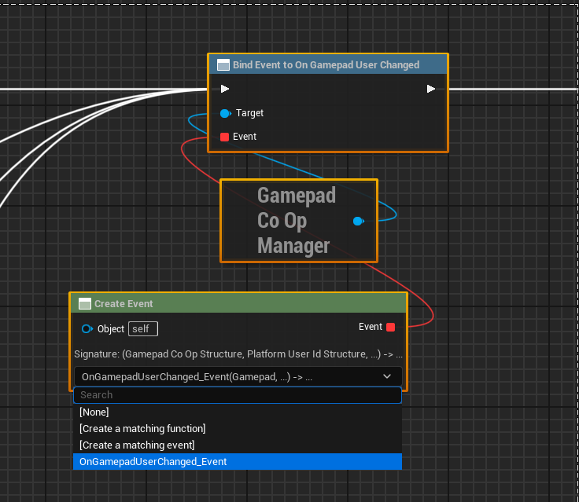
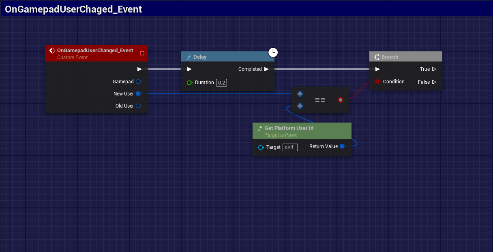

# 🎮 GamepadCoOp

[](https://semver.org)
[](LICENSE.md)
[](https://www.microsoft.com/windows)
[](https://www.unrealengine.com)

**GamepadCoOp** is an Unreal Engine plugin that provides robust gamepad management to simplify the creation of local multiplayer experiences. It offers an abstraction layer over the engine's input system to monitor and manage the association between hardware devices and game users.

## ✨ Key Features

*   **Centralized Management**: Access all connected gamepads through a `GameInstanceSubsystem` (`UGamepadCoOpManager`), ensuring a single point of management throughout the game's lifecycle.
*   **Dynamic User Remapping**: The core feature of the plugin is the ability to dynamically remap an `FInputDeviceId` (physical device) to a different `FPlatformUserId` (game user) at runtime. This allows for easy implementation of player or profile swapping.
*   **Connection Monitoring**: The plugin automatically detects gamepad connections and disconnections, providing delegates for your game logic to react to these events.
*   **Event Delegates**: Respond to important gamepad lifecycle events:
    *   `OnGamepadConnected`
    *   `OnGamepadDisconnected`
    *   `OnGamepadUserChanged`
*   **C++ and Blueprint API**: Designed to be fully accessible in both C++ and Blueprints, allowing for flexible integration with any project type.

## 🚀 Installation

1.  Download the latest version from the [Releases page](https://github.com/YourRepo/GamepadCoOp/releases).
2.  Create a `Plugins` folder in your Unreal project's root directory if it doesn't already exist.
3.  Extract the contents into the `Plugins` folder.
4.  Open your project. The Unreal editor will prompt you to compile the plugin.
5.  In the editor, go to `Edit > Plugins`, search for `GamepadCoOp`, and ensure it is enabled.

## 🎬 Demo
[link](https://github.com/rafaelvaloto/GamepadCoOp/blob/main/Images/AnimationCoOp.gif)


## 💡 How to Use

The plugin operates as a `GameInstance` subsystem, making access to it direct and consistent.

### Accessing the Manager

To start using the plugin, get the instance of `UGamepadCoOpManager`.

**Blueprint:**

Use the `Get Game Instance` node, followed by `Get Subsystem`, and select `GamepadCoOpManager`.



List all devices


Event OnGamepadUserChanged


Event OnGamepadUserChanged



### Usage Example (C++)

The code below demonstrates how to implement a function that swaps gamepads between Player 0 and Player 1.

First, add the module as a dependency in your `.Build.cs` file:

```c++
    PublicDependencyModuleNames.AddRange(new string[] { "GamepadCoOp" });
```

```c++  
    #include "Commons/GamepadCoOpManager.h" 
```

```c++
   
    // Example function that can be called in a GameMode or PlayerController void AMyGameMode::SwapControllersForPlayers() { UGamepadCoOpManager* CoopManager = UGamepadCoOpManager::Get(this); if (!CoopManager) { return; }

    // Get the User IDs for players 0 and 1
    const FPlatformUserId Player0_UserId = CoopManager->CoOpPlatformUserId(0);
    const FPlatformUserId Player1_UserId = CoopManager->CoOpPlatformUserId(1);
    
    // Find which input device each player is using
    const FInputDeviceId Player0_DeviceId = CoopManager->GetPrimaryGamepadForUser(Player0_UserId);
    const FInputDeviceId Player1_DeviceId = CoopManager->GetPrimaryGamepadForUser(Player1_UserId);
    
    // If both devices are valid, perform the swap
    if (Player0_DeviceId.IsValid() && Player1_DeviceId.IsValid())
    {
        UE_LOG(LogTemp, Log, TEXT("Swapping gamepads between user %d and %d"), Player0_UserId.GetInternalId(), Player1_UserId.GetInternalId());
    
        // Remap Player 0's device to Player 1
        CoopManager->RemapGamepadToUser(Player0_DeviceId, Player1_UserId);
    
        // Remap Player 1's device to Player 0
        CoopManager->RemapGamepadToUser(Player1_DeviceId, Player0_UserId);
    }

```

## 🤝 Contributions

Contributions are welcome. If you find a bug or have a suggestion, please open an [Issue](https://github.com/YourRepo/GamepadCoOp/issues). To contribute with code, fork the repository and submit a Pull Request.

## 📄 License

This project is distributed under the MIT license. See the `LICENSE.md` file for more details.

